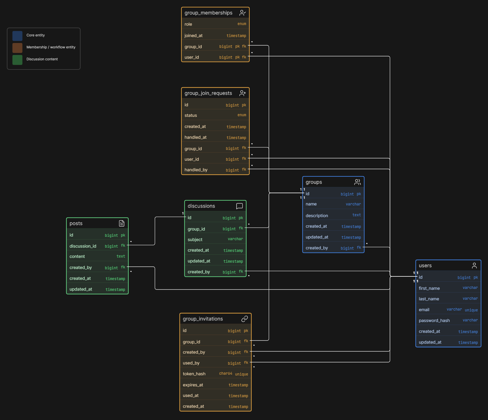

# Samtli

Samtli is a server-rendered PHP community platform for interest-based groups, discussions and role-based membership management.

## About

The project is built as a course assignment and portfolio project. The goal is a clear PHP application where users can create groups, request membership, discuss topics and manage group roles securely.

## Current Status

The repository foundation, database schema, user registration and login flow are implemented. Groups, memberships, discussions and invitations are still planned feature work. The first milestone remains a full VG implementation of the assignment scope.

## Core Assignment Scope

Samtli will include accounts, groups, memberships, discussions, replies, join requests, per-group member and administrator roles, administrator approvals, role management and 24-hour single-use invitation links.

## Tech Stack

- PHP 8.4
- MariaDB
- PDO
- Composer
- HTML/CSS
- Vanilla JavaScript where useful
- Docker
- Coolify deployment target
- Postman for assignment verification

## Architecture

The codebase is organized around Controllers, Services, Repositories, Security helpers, server-rendered Templates and SQL database migrations.

See `docs/ARCHITECTURE.md`.

The database schema is documented in `docs/database/SCHEMA.md`.

Entity relationship diagram:



## Design

Google Stitch mockups are stored in `docs/design-reference/` and are the visual source of truth for implementation. Common components must remain visually consistent across the application.

Reference files:

- `docs/design-reference/DESIGN.md`
- `docs/design-reference/SCREEN_INVENTORY.md`
- `docs/design-reference/COMPONENT_INVENTORY.md`

## Local Development

Create a local environment file:

```bash
cp .env.example .env
```

Start the stack:

```bash
docker compose up --build
```

Apply database migrations:

```bash
docker compose exec app php bin/migrate.php
```

The equivalent Composer command inside the application container is:

```bash
composer migrate
```

Open:

```text
http://localhost:38515
```

Stop the stack:

```bash
docker compose down
```

## Environment Configuration

Configuration is read from environment variables. Required variables are documented in `.env.example`, including `APP_ENV`, `APP_DEBUG`, `APP_URL`, `APP_PORT`, `DB_HOST`, `DB_PORT`, `DB_DATABASE`, `DB_USERNAME` and `DB_PASSWORD`.

Do not commit a real `.env` file or production secrets.

## Deployment

The intended deployment target is Coolify using Docker on the homelab.

- Host-facing application port: `38515`
- Application container port: `80`
- Planned public URL: `https://samtli.hampusandersson.dev`

The public URL is a deployment target. It is not claimed as live by this repository bootstrap.

Coolify should inject production environment variables and connect the application container to a persistent MariaDB resource.

## Assignment

See `docs/ASSIGNMENT.md`.

## Roadmap

See `docs/ROADMAP.md`.
